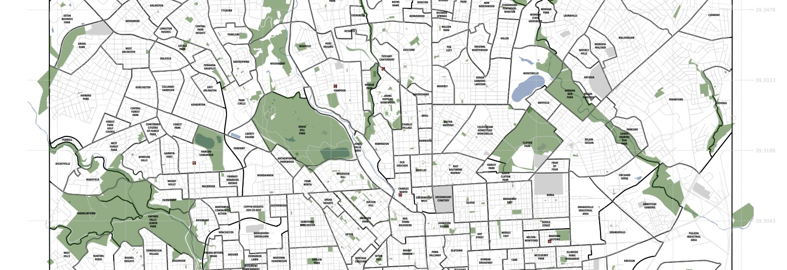

# Baltimore Map

This repository will generate a high-quality PDF map of Baltimore's neighborhoods at 2' x 3' size.
It also includes parks, water features, and ghost bikes.
The underlying representation is properly vector-based, as opposed to tile-based, so it should be easy to adapt this to any size you like.

There are hundreds of other features you could include when pulling data from Open Street Map.
Consider taking a look!

# Building the map PDF

First, make sure you install the requirements:

    pip install -r requirements.txt

Then, run the script:

    python3 baltimore.py

This will create a file, baltimore.pdf. This file is also cached under `maps/`, where you can also find the map version with legend.

There is also another script, `city.py`, that you can use for arbitrary cities.
It doesn't work equally well for all of them; it's best if the city has neighborhods defined in Open Street Map (administrative level = 10).
A few good examples are:

    ./city.py "Berlin, Germany"
    ./city.py "St. Louis, MO"

One that doesn't look as good because it lacks neighborhood data is Grand Rapids, MI.

This is really provided as a launching point for a custom city map.

# What's missing

What's mostly missing is street names. Adding labels for streets is a complicated process, however, that I believe is usually done manually or at least semi-automatically and then made available via tiles, rather than generated by scratch.
It would be nice to add this information, however.

# Credits

I am indebted to the City of Baltimore, Open Street Map, and Geoff Boeing.

* The City of Baltimore [provides excellent resources](https://planning.baltimorecity.gov/maps-data/gis), including a neighborhood map that includes a complete list of neighborhoods not found in Open Street Map.
* Open Street Map provides all the street-level data, as well as layers upon layers of annotations. You should consider contributing when you find an error; I've made a number of edits myself!
* Geoff Boeing is the author of [OSMnx](https://github.com/gboeing/osmnx), an amazing Pythong wrapper around Open Street Map data.
